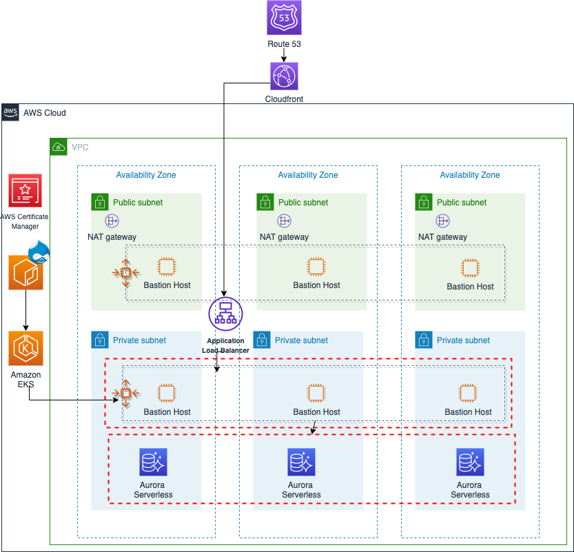

# Drupal on AWS 

#### Mordernizing Drupal deployment with Amazon EKS 
This Quick Start deploys a highly available cloud native Drupal architecture on the Amazon Web Services (AWS) Cloud.

[Drupal](https://www.drupal.org/) is an open-source, content management platform written in the PHP server-side scripting language, and provides a backend framework for many enterprise websites and applications. Its tools help you build versatile, structured content for dynamic web experiences.

Deploying Drupal on AWS makes it easy to use AWS services to further enhance the performance. 
This guide uses [Amazon EKS](https://aws.amazon.com/eks/), [Amazon Elastic Container Registry](https://aws.amazon.com/ecr/), [Amazon Aurora Serverless](https://aws.amazon.com/rds/aurora/serverless/)

**Amazon Elastic Kubernetes Service** (Amazon EKS) is a fully managed Kubernetes service.EKS runs the Kubernetes management infrastructure across multiple AWS Availability Zones.
**Amazon Elastic Container Registry (ECR)** is a fully-managed Docker container registry that makes it easy for developers to store, manage, and deploy Docker container images.
**Amazon Aurora Serverless** is an on-demand, auto-scaling configuration for Amazon Aurora (MySQL-compatible and PostgreSQL-compatible editions), where the database will automatically start up, shut down, and scale capacity up or down based on your application's needs. It enables you to run your database in the cloud without managing any database instances. 
The AWS CloudFormation templates included with the Quick Start automate the following:

- Deploying Drupal into a new virtual private cloud (VPC) on AWS
- Deploying Drupal into an existing VPC on AWS

You can also use the AWS CloudFormation templates as a starting point for your own implementation.

To post feedback, submit feature ideas, or report bugs, use the **Issues** section of this GitHub repo...
If you'd like to submit code for this Quick Start, please review the [AWS Quick Start Contributor's Kit](https://aws-quickstart.github.io/).
